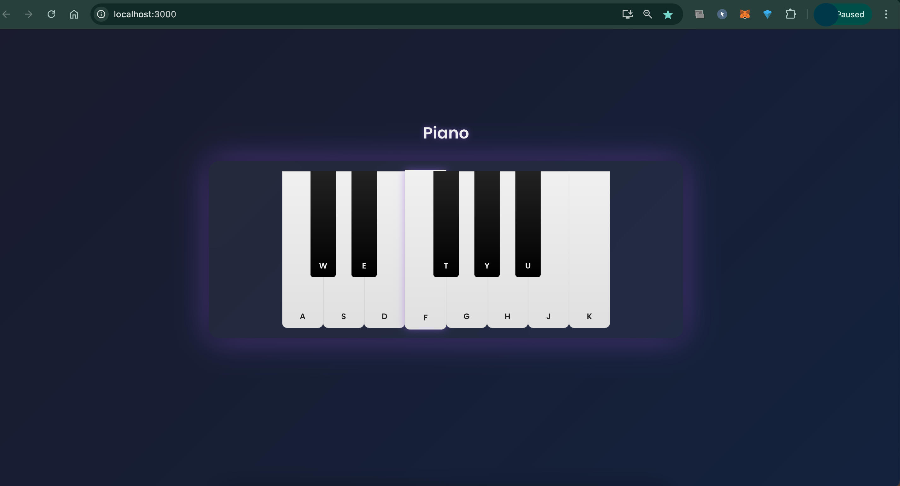

# 🎹 Tone.js Piano

A simple, interactive piano built using [Tone.js](https://tonejs.github.io/), vanilla JavaScript and React . Designed for fun, learning, and as a mini-project to explore web audio programming.

---

## 🚀 Features
- Play musical notes using a sleek piano UI.
- Powered by Tone.js for realistic audio synthesis.
- Lightweight and easy to run locally.

---

## 🛠️ Setup & Usage

1. **Clone the Repo**:
  ` git clone https://github.com/your-username/tonejs-piano.git
   cd tonejs-piano`
2. **Install Dependencies**:
   ` npm install`
3. **Run Locally**

## 📝 License

This project is licensed under the [MIT License](LICENSE).

